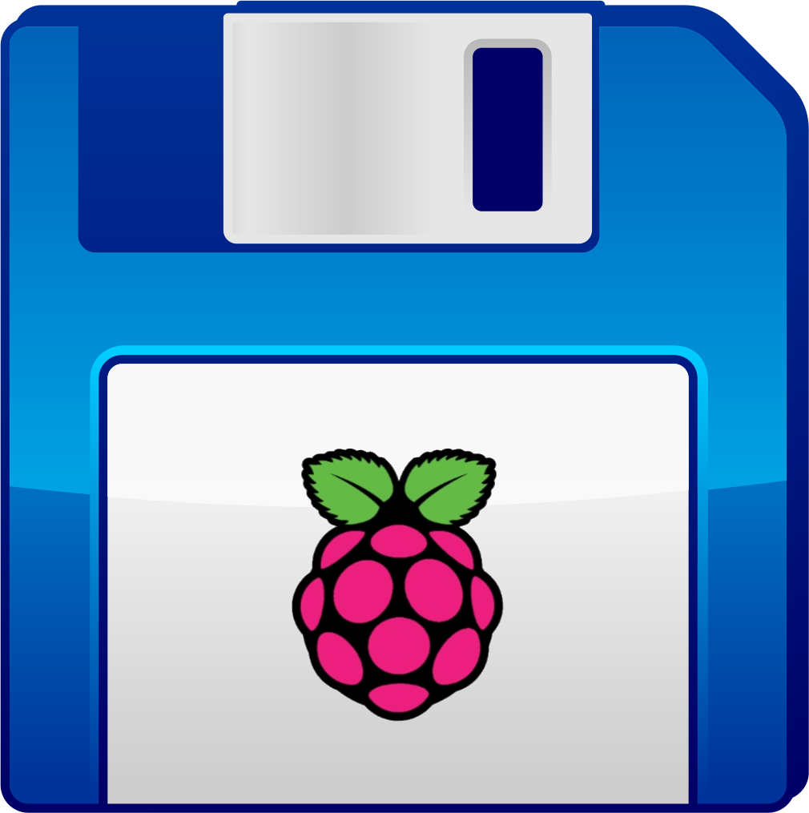

<div align="center">
  
  <br><br>
  <p>
    
    
  </p>
</div>

# pibackup.sh

`pibackup.sh` is a bash script that automatically dump a PI sdcard as a shrunk image to a [remote] directory, and handles rotation of several files. It is recommended to automate this script using `systemd` timers or `cron`, so the backups are done on a regular basis and without any interaction.

This is still WIP work, let me know if you have ideas about how to improve.

## Table of content

1. [Background](#background)
2. [Usage](#usage)
3. [Prerequisites](#prerequisites)
   1. [Optional dependencies](#optional-dependencies)
4. [Installation](#installation)
5. [Example](#example)
6. [Restoring](#restoring)
7. [Automation](#automation)
   1. [systemd timer](#systemd-timer)
   2. [cron job](#cron-job)
8. [Contributing](#contributing)

## Background

Once during a house move, I unplugged a Raspberry PI and somehow it killed the SD card. All my code was saved already, but I lost hours of my time spent on configuring and pimping my PI. I was so mad at myself for not doing backups that I started to look into automatic backup tools, but I didn't find anything that pleased me enough. So I bought an external drive and started this project.
Hope it will be useful for more people than just myself!

## Usage

**Note:** It will create a `<output>/<target>` directory, so you can use the same output directory for multiple nodes.

```bash
$ ./pibackup.sh -h
---
pibackup.sh 0.5
---

usage: pibackup.sh -o <output> [options]

Required parameters:
  -o, --output-dir [DIRECTORY]  Where backup will be saved and rotated.

Optional parameters:
  -h, --help                    Display this message.
  -n, --image-name [NAME]       Rename the backup file as '<TARGET>.img.x'.
                                  Default: self ($ uname -n)
  -r, --rotation-count [COUNT]  Quantity of files to be kept. Default: 8
  -t, --tmp-dir [DIRECTORY]     Temporary directory to use on the remote node. Default: /tmp
  -T, --target [HOSTNAME]       Name of the host to backup. Default: self ($ uname -n)
  -q, --quiet                   Silent mode.
  -z, --gzip                    Compress image using gzip.
  -Z, --xz                      Compress image using xz.
```

## Prerequisites

1. **External disk space:** At the moment, you cannot dump your sd card on itself; you need a proper storage. For instance, I have a disk drive plugged to my main Raspberry PI that other nodes will remotely interact with.

2. **Fast local network:** If doing remote backup, you need to make sure your network is efficiently configured. I had speed issues at home, so I had to create a local network for my PIs, which greatly increased the backup upload speed.

3. This project uses [PiShrink](https://github.com/Drewsif/PiShrink) from Drewsif. Make sure to install it before.

```bash
$ which pishrink.sh
/usr/local/bin/pishrink.sh
```

### Optional dependencies

1. If using `cron` you may need `postfix` to deliver local mails:

```bash
sudo apt install postfix
```

## Installation

All you need to do is download `pibackup.sh`, make it executable and put it in your PATH.

```bash
wget https://raw.githubusercontent.com/Chocorean/pibackup/main/pibackup.sh
chmod +x pibackup.sh
sudo mv pibackup.sh /usr/local/bin
```

## Example

For a local backup, this is simplest you can use:

```bash
user@pi $ pibackup.sh -o /backups -n awesome_pi
[pibackup.sh] Dumping sdcard ...
[ ... dd output ... ]
[pibackup.sh] Setting permissions ...
[pibackup.sh] Shrinking image ...
[ ... pishrink.sh output ... ]
[pibackup.sh] Rotating previous images ...
[pibackup.sh] Done ...
user@pi $ ls /backups/pi
awesome_pi.img.0
```

For a remote node, just specify its hostname or IP address.

```bash
user@pi$ pibackup.sh -o /backups -d another_pi
[pibackup.sh] Dumping sdcard ...
[ ... dd output ... ]
[pibackup.sh] Setting permissions ...
[pibackup.sh] Shrinking image ...
[ ... pishrink.sh output ... ]
[pibackup.sh] Rotating previous images ...
[pibackup.sh] Done ...
user@pi $ ls /backups/another_pi
another_pi.img.0
```

## Restoring

Doing backups is a good thing, however you know to know how to restore them. Right now, I haven't looked at the newest feature which allows to boot from the network, but I might add a section about it later.

Use a computer with access to the storage drive. If you compress your images, you will need to decompress them first:

```bash
# -Z ; xz
cp /path/to/backup.xz.0 backup.xz
unxz backup.xz

# -z ; gzip
cp /path/to/backup.gz.0 backup.gz
gunzip backup.gz
```

Now you have a suitable image for flashing an SD card. Plug the SD card you want to overwrite and copy the image:

```bash
sudo dd if=backup.img of=/dev/mmcblk0 bs=4M conv=noerror,sync status=progress
```

Insert the SD card in your PI and you recovered all your data!

## Automation

The recommended way to use `pibackup.sh` is to create a `systemd` timer-service duo, but a `cron` job will work fine. You also need to make sure your nodes have a proper SSH config which allows the main node to connect to them without asking for password (see `~/.ssh/authorized_keys` file).

### systemd timer

You will first need to create the timer and the associated service. Then, enable and start the timer:

```bash
# systemctl enable pibackup.timer
# systemctl start pibackup.timer
```

Check [the docs](https://man.archlinux.org/man/systemd.time.7#CALENDAR_EVENTS) for `OnCalendar=` syntax.

<details>
  <summary>systemd timer example</summary>
  <p>
    /etc/systemd/system/pibackup.timer
    
    [Unit]
    Description=Run pibackup.sh every monday at 2am
    
    [Timer]
    Unit=pibackup.service
    OnCalendar=Mon, 2:00

    [Install]
    WantedBy=timers.target
  </p>
</details>
    
<details>
  <summary>systemd service example</summary>
  <p>
    /etc/systemd/system/pibackup.service
    
    [Unit]
    Description=Run pibackup

    [Service]
    Type=oneshot
    ExecStart=/usr/local/bin/pibackup.sh ...
    User=pi
  </p>
</details>

Thanks to [Mcdostone](https://github.com/Chocorean/pibackup/issues/8) for the suggestion.

### cron job

I recommend to seperate `cron` logs from `syslog` logs for easier troubleshooting. If not the case already, edit `/etc/rsyslog.conf` and uncomment `cron.*  /var/log/cron.log`.
As stated in the [Prerequisites](#prerequisites) section, you may also need to install `postfix` because `cron` sends mails if a job has an output.

**Also**, I had to set `SHELL` and `PATH` variables inside the crontab to make it work, but that might not be necessary for you.

Check [the docs](https://www.man7.org/linux/man-pages/man5/crontab.5.html) for `crontab` syntax.

<details>
  <summary>crontab example</summary>
  <p>
    $ crontab -e

    # default shell
    SHELL=/bin/bash
    # set PATH variable
    PATH=/usr/local/sbin:/usr/local/bin:/usr/sbin:/usr/bin:/sbin:/bin:/snap/bin

    # Do a backup once a week on Mondays at 2am
    0 2 * * MON /usr/local/bin/pibackup.sh ...
  </p>
</details>

## Contributing

Quoting Drewsif:

> If you find a bug please create an issue for it. If you would like a new feature added, you can create an issue for it but I can't promise that I will get to it.
>
> Pull requests for new features and bug fixes are more than welcome!
